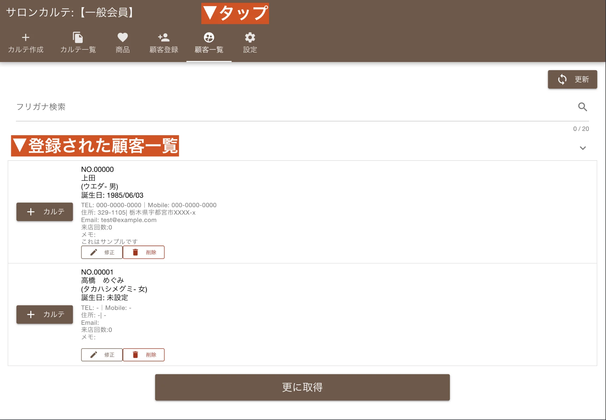

サロンカルテでは、お客様一人ひとりの大切な情報を正確に登録・管理することができます。このページでは、**新規顧客の登録手順から、登録済みの顧客情報の確認・修正方法まで**を詳しく解説。基本的な顧客情報を正しく入力することで、スムーズなカルテ作成と、お客様へのきめ細やかなサービス提供が可能になります。

## 1. 新規顧客情報を登録する {#register_new_customer}

お客様の来店時や、新規顧客獲得の際に、以下の手順で顧客情報を登録しましょう。正確な情報登録が、今後のスムーズな顧客管理の基盤となります。

### 手順1-1：顧客登録画面を開く {#open_cust_register}

（具体的な操作：例「サイドメニューから『顧客登録』をタップします」など、画面遷移の指示があるとより親切です）

### 手順1-2：必須項目と任意項目を入力 {#input_fields}

上の画像は顧客登録画面です。顧客情報は以下の項目を入力して作成します。

<dl class="basic">
  <dt>顧客番号 必須</dt>
  <dd>
    5桁の数字で構成される、お客様を特定するための一意のIDです。入力必須項目であり、すでに使用済みの番号は重複して使用できません。自動採番機能もご活用いただけます。
  </dd>
  <dt>名前・フリガナ 必須</dt>
  <dd>
    お客様のフルネームを入力します。フリガナは全角カタカナで入力してください。
  </dd>
  <dt>メールアドレス</dt>
  <dd>
    お客様のメールアドレスです。1件のみ登録可能です。お客様アプリ連携時や、お知らせ配信などで活用できます。
  </dd>
  <dt>誕生日</dt>
  <dd>
    お客様の誕生日を登録します。入力時にはテンキーがポップアップで表示され、スムーズな入力が可能です。誕生月特典などにも活用できます。
  </dd>
  <dt>電話番号・携帯電話</dt>
  <dd>
    お客様の電話番号を入力します。入力時にはテンキーがポップアップで表示されます。連絡手段として重要な項目です。
  </dd>
  <dt>郵便番号</dt>
  <dd>
    郵便番号を入力します。入力時にはテンキーがポップアップで表示されます。住所入力の補助にもなります。
  </dd>
  <dt>住所</dt>
  <dd>
    お客様の住所を入力します。DM送付などに活用できます。
  </dd>
  <dt>性別</dt>
  <dd>
    「男・女」から選択します。統計データや性別に合わせたサービス提供に役立ちます。
  </dd>
  <dt>顧客メモ</dt>
  <dd>
    お客様に関する特記事項や、個人的な情報（例：好き嫌い、アレルギーなど）を自由にメモできます。お客様とのコミュニケーションに役立ててください。
  </dd>
</dl>

### 手順1-3：登録を完了する {#complete_register}

全ての情報の入力が終わったら、画面下部の「保存ボタン」を押して登録を完了します。
登録が完了すると、各種入力フォームは空に戻るため、続けて次の顧客情報をスムーズに登録することが可能です。

## 2. 登録した顧客情報を確認する {#view_registered_customer}

登録した顧客情報が正しく保存されているか、または既存の顧客情報を確認したい場合は、以下の手順で顧客一覧から確認できます。

### 手順2-1：顧客一覧画面へ移動 {#move_cust_list}

上部メニューから「顧客一覧」をタップします。

### 手段2-2：顧客情報の確認 {#check_customer}

顧客一覧画面では、登録されている顧客がリスト形式で表示されます。名前や顧客番号で目的のお客様を素早く見つけることができます。

## 3. 登録した顧客情報を修正する {#edit_registered_customer}

登録内容に変更があった場合や、情報の追加を行いたい場合は、以下の手順で顧客情報を修正できます。

### 手順3-1：顧客編集画面を開く {#open_cust_edit}

顧客一覧から修正したいお客様を見つけ、該当のお客様の行をタップ（または「修正」ボタンをタップ）します。

### 手段3-2：情報を修正して保存 {#update_customer}

顧客編集画面で必要な情報を変更・追加し、最後に「保存ボタン」をタップして更新を完了します。

:::caution[【重要】顧客番号は変更できません]
顧客番号は、一度登録すると変更できない一意のIDです。システム内部で各カルテと紐付けられているため、やむを得ず顧客番号を変更する必要がある場合は、一度該当の顧客情報を削除し、新しい顧客番号で再登録していただく必要がありますのでご注意ください。
:::

  顧客情報の登録・管理は、サロン運営の基本です。 
  正確な顧客データは、お客様へのパーソナルなサービス提供に役立ちます。

